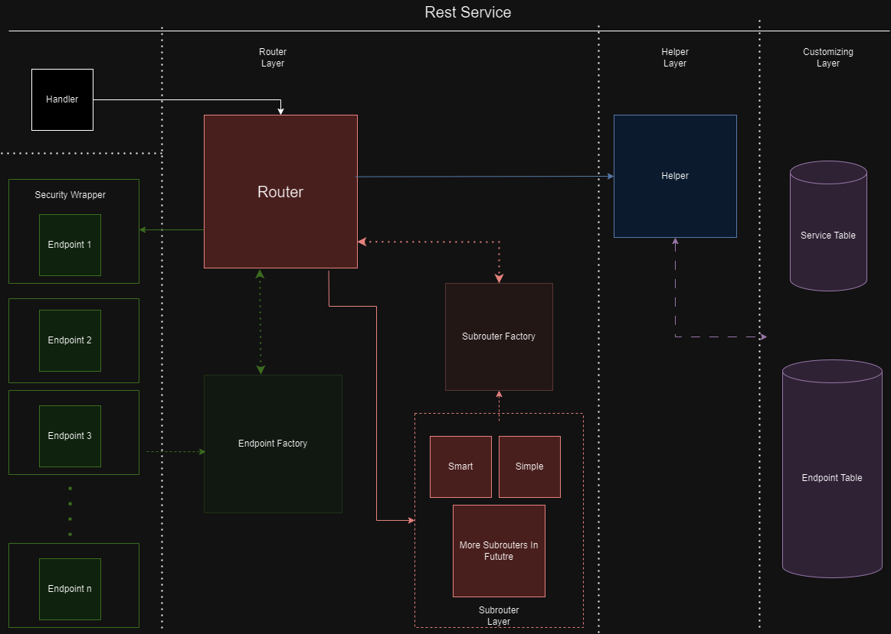

# Rest Service Overview

- The Framework consists of 3 layers, where each layer is responsible for specific task.  
- These layers are:
>- Router Layer - Responsible for redirecting traffic to correct endpoint  
>- Helper Layer - Serves to seperate logic between router and database 
>- Customizing Layer - Layer consists of customizing tables that users can modify 

## Router Layer
Router Layer consists of Routers, Subrouters and Factory Classes that serve to redirect traffic to correct endpoint.  
### Router Classes
Router class serves as a generic logic, that controlls the entire logic. It's job is to create helper, use the helper in factory classes, run correct subrouter and then the correct endpoint.  
For more information see [ZCL_REST_ROUTER](/classes/ZCL_REST_ROUTER) 
### Subrouter Classes
The job of Subrouters is to find correct path based on URI. It doesn't consern if the endpoint exists, just that the route does.  
Each service can have different subrouter. 
Subrouters use interface [ZIF_REST_SUBROUTER](/interfaces/ZIF_REST_SUBROUTER). 
### Factory Classes
Factory classes serve to create objects based on data they get from helper. 
Framework currently has two factory classes 
[ZCL_REST_SUBROUTER_FACTORY](/classes/ZCL_REST_SUBROUTER_FACTORY) and 
[ZCL_REST_ENDPOINT_FACTORY](/classes/ZCL_REST_ENDPOINT_FACTORY)
## Helper Layer
Helper Layer is an abstraction between database and other logic. It's whole purpose is to seperate database logic to it's own class so that the framework is more maintainable. 
See [ZCL_REST_ROUTER_HELPER](/classes/ZCL_REST_ROUTER_HELPER) for more info. 
## Customizing Layer
Customizing Layer consists of customizing tables. These tables can be modified by users for their own services and methods. 
See:  
>- [ZCT_SERVICE](/service/)
>- [ZCT_ENDPOINT](/endpoint/)
